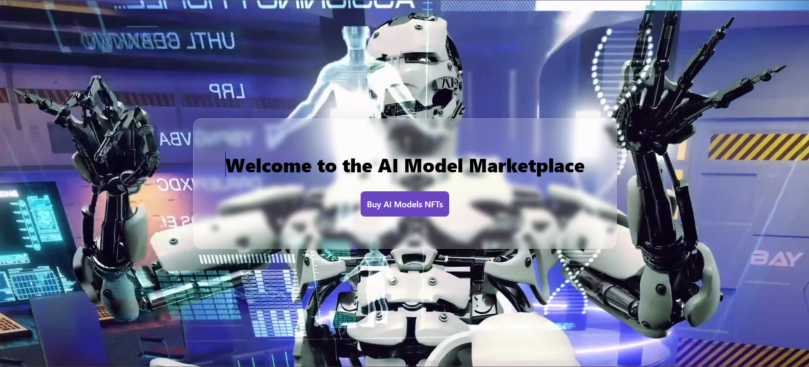

#  Syntax Sorcerers
## AI Model Marketplace

## Overview

The AI Model Marketplace is a decentralized platform that facilitates the buying, selling, and licensing of AI models and algorithms. Powered by blockchain technology, our platform connects developers, data scientists, and organizations, enabling them to exchange innovative AI solutions across various industries.

## System Architecture


## Features

- **Decentralized Platform**: Eliminate intermediaries and facilitate direct transactions between buyers and sellers.
- **Transparent Usage Rights**: Smart contracts govern usage rights and ensure fair compensation for developers.
- **Global Accessibility**: Access a diverse range of AI models tailored to specific needs from anywhere in the world.

## Technologies Used

- Next.js: Frontend framework for building React applications.
- Andromeda.js: Blockchain framework for decentralized applications.
- ADO Builder: Tool for building decentralized autonomous organizations (ADOs).
- Function: signandbroadcast - Incorporating purchasing of multiple NFTs using a single transaction.

## Getting Started

1. Clone the repository:

   ```bash
   git clone https://github.com/your-username/ai-model-marketplace.git
   ```

2. Navigate to the project directory:

   ```bash
   cd ai-model-marketplace
   ```

3. Install dependencies:

   ```bash
   npm install
   ```

4. Start the development server:

   ```bash
   npm run dev
   ```

5. Open [http://localhost:3000](http://localhost:3000) in your browser to view the project.

## Deployment

To deploy the project locally, follow these steps:

1. Clone the project repository from GitHub.
2. Navigate to the project directory.
3. Install dependencies using `npm install` or `yarn install`.
4. Start the development server using `npm run dev` or `yarn dev`.
5. Open [http://localhost:3000](http://localhost:3000) in your browser to view the project.
6. You can start editing the page by modifying pages/index.tsx. The page auto-updates as you edit the file.
7. API routes can be accessed on [http://localhost:3000/api/hello](http://localhost:3000/api/hello). This endpoint can be edited in pages/api/hello.ts.
8. The pages/api directory is mapped to /api/*. Files in this directory are treated as API routes instead of React pages.

## Photos and Videos




## Contributing

Contributions are welcome! Please open an issue or submit a pull request for any new features, improvements, or bug fixes.
```

You can add photos and videos by providing their paths or URLs in the "Photos and Videos" section. Make sure to replace `"path/to/system_architecture.png"` with the actual path or URL to the system architecture image.
